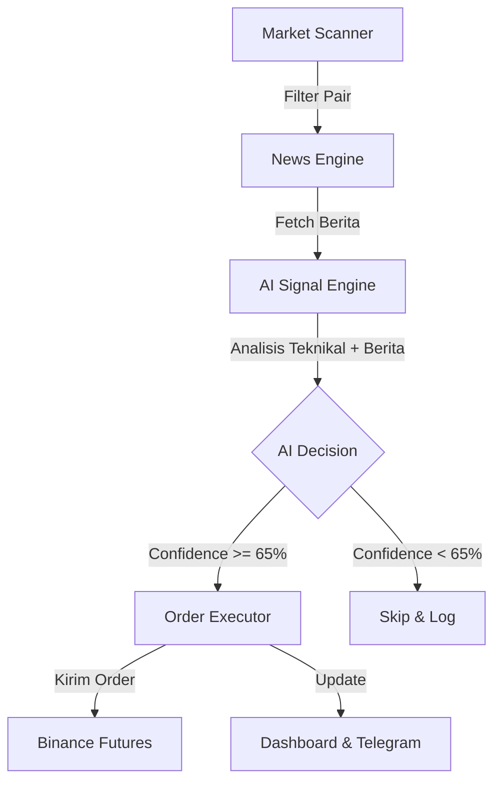

# Flow Keputusan Entry MnL-Trade AI

Dokumen ini menjelaskan alur sistem dari awal scan market hingga bot memutuskan untuk melakukan entry (Open Position).

## 1. Arsitektur Pengambilan Keputusan

Sistem beroperasi dalam siklus berulang (setiap 15 menit) yang melibatkan 4 modul utama:

---

## 2. Tahapan Detail

### Tahap 1: Market Scanner (`scanner.py`)
Bot melakukan filter terhadap semua pair yang ada di Binance Futures:
- **Volume 24 Jam:** Harus di atas `$50,000,000` (configurable).
- **Volatilitas:** Harga harus bergerak minimal `2%` dalam 24 jam.
- **Top Picks:** Mengambil top 10-20 pair paling potensial untuk dianalisis lebih lanjut.

### Tahap 2: News Aggregator (`news_engine.py`)
Bot mencari sentimen fundamental:
- Mengambil berita terbaru dari **CryptoPanic** dan **NewsAPI**.
- Mencari berita yang spesifik menyebutkan nama coin (misal: "SOL", "Solana").
- Menyimpan berita ke database untuk dilampirkan ke prompt AI.

### Tahap 3: Technical Analysis (`ai_signal.py`)
Bot menghitung indikator teknikal secara internal (timeframe 15m):
- **RSI (14):** Menentukan area Oversold (<30) atau Overbought (>70).
- **EMA (20, 50, 200):** Menentukan trend (Golden Cross/Death Cross).
- **MACD:** Melihat momentum harga.
- **Bollinger Bands:** Melihat volatilitas dan deviasi harga.

### Tahap 4: AI Analysis (Gemini/DeepSeek/Claude)
Semua data (Teknikal + Berita) dikirim ke AI dengan instruksi (Prompt) khusus. 
AI akan mengevaluasi:
- **Konfluensi:** Apakah berita mendukung indikator teknikal? (Misal: Berita Bullish + RSI Rebound).
- **Risk/Reward:** Menghitung letak Entry, Stop Loss (SL), dan Take Profit (TP).

**Prioritas AI:**
Bot secara otomatis mendeteksi API Key yang tersedia dengan urutan prioritas:
1. **Gemini** (Fastest & Reliable)
2. **DeepSeek** (Economic & Solid)
3. **Claude** (High Intelligence)

**Kriteria Keputusan:**
- **LONG:** AI sangat yakin harga akan naik.
- **SHORT:** AI sangat yakin harga akan turun.
- **SKIP:** Data tidak jelas atau market sedang sideways.

### Tahap 5: Eksekusi Order (`order_executor.py`)
Sebelum entry, bot melakukan validasi terakhir:
1. **Max Positions:** Apakah jumlah posisi terbuka sudah mencapai batas (misal: 5)?
2. **Risk Management:** Menghitung ukuran posisi (Quantity) berdasarkan 1% modal.
3. **Execution:** Mengirim bracket order (Entry + SL + TP) sekaligus ke Binance.

---

## 3. Logika "Confidence Score"

Sistem menggunakan skor 0-100 untuk menentukan kekuatan sinyal:

| Score | Aksi | Keterangan |
|-------|------|------------|
| **< 65** | **SKIP** | Sinyal terlalu lemah/berisiko. |
| **65 - 79** | **ENTRY** | Sinyal moderat, entry dengan risk normal. |
| **80 - 100** | **ENTRY** | Sinyal kuat, konfluensi teknikal & berita sangat tinggi. |

---

## 4. Monitoring
Setiap keputusan AI (termasuk alasan/Reason) disimpan di tabel `signals` dan bisa dilihat langsung di:
- **Dashboard Web:** Tab "AI Signals".
- **Telegram Bot:** Notifikasi otomatis setiap ada sinyal baru.
